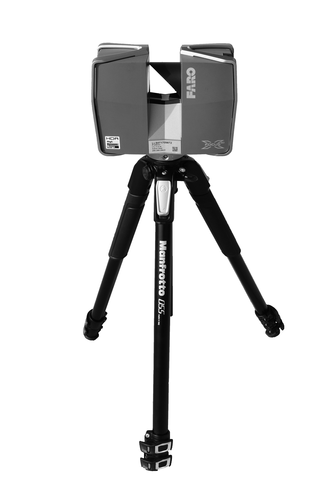
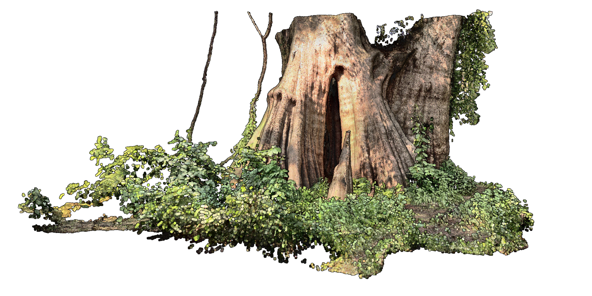
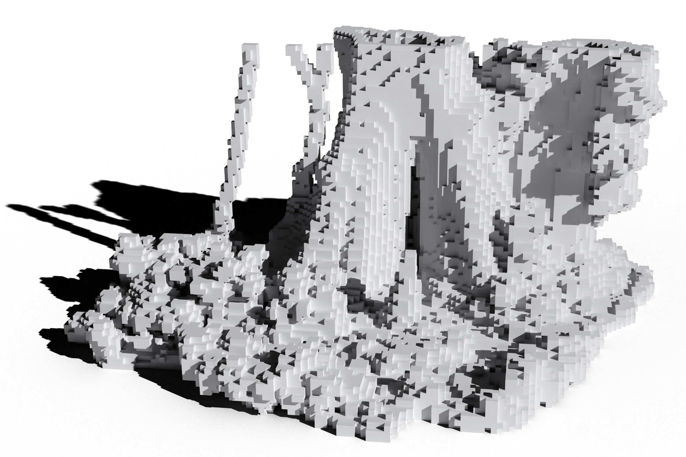

+++
title = "Computational Design for Landscape Architects"
outputs = ["Reveal"]
+++

# Computational Design
### for Landscape Architects

[Brendan Harmon](https://baharmon.github.io/)


Hello. 
I am Brendan Harmon,
an assistant professor of landscape architecture
at Louisiana State University.
Today I will be talking about
my recent research and teaching.
While I have expertise in the spatial sciences,
recently I have been focused on computational design
- on the creative use of computation in the design process.
Computational design is design with data,
with algorithms and simulations.
This talk will explore several applications
of computational design -
heritage preservation,
point cloud modeling,
computational ecology,
and ecological robotics. 


---

# Heritage Preservation


My research in heritage preservation 
uses remote sensing technologies such as lidar
to preserve a record of disappearing heritage landscapes.


---


I use drones with lidar, 
terrestrial laser scanning,
and neural radiance fields
to record the spatial structure
and phenomenological character
of heritage landscapes.


---



# Rosedown


With funding from the National Park Service,
my colleague Nick Serrano and I
scanned Rosedown Plantation
in St. Francisville, Louisiana.
Rosedown is unique for its extant, largely intact plantation gardens;
these gardens are important
not only for being representative of 
plantation garden design in the American South,
but also as artifacts of enslaved labor.


---




With terrestrial laser scanning,
we captured temporal aspects of the landscape
such as the flowers in bloom on the rockery
- pictured here -
and the spanish moss swaying
on the live oak allee. 


---




The scan of the tunnel through the rockery,
captured details such as the pebble wash
and the moss and lichen on the bricks.
This level of immersive detail records
some of sensory experience and phenomenological character
of the site in ways that other media cannot.


---




The scan of the service staircase
captures how the tall steps are worn underfoot,
recording an index of the labor of the enslaved.


---



# African American Burial Grounds


With an interdisciplinary team of colleagues,
I have begun a long term project
to preserve a record of the burial grounds
of enslaved African Americans and their descendants.
In the American South, 
These sites have long faced precarious conditions; 
originally built peripheral to antebellum plantations, 
today many occupy remnant parcels of isolated land. 
Climate change, 
industrial expansion, 
precarious land-tenure records, 
and dwindling populations of descendant communities 
threaten these cultural landscapes. 
The aim of this project 
is to develop a methodology for documenting 
the history, material culture, 
ecological character, and soundscapes 
of these neglected heritage sites. 
Here is a point cloud of Alford Cemetery
captured by a drone with a lidar module.
With drone lidar,
we can record these landscapes and their surroundings
at centimeter resolution. 


---




With terrestrial laser scanning,
we can record gravesites in immersive detail.
We are also experimenting with 
new scanning techniques such as 
neural radiance fields. 


---

# Point Clouds


I am also interested in point clouds
as a new design medium for landscape architecture,
that is both hyper-detailed, yet also abstract.


---



# Point Cloud Modeling


I have been experimenting with
point cloud modeling techniques.
Complex, detailed scenes can be composited
by segmenting, transforming, and merging point clouds. 
Features can be classified and segmented
either manually or automatically
with algorithms and machine learning techniques.
Segmented point clouds can be transformed manually 
or algorithmically with, for example, Grasshopper.
Here is a simple example of 
randomly scattered laser scanned plants.


---

# Computational Ecology


My research in computational ecology
explores the use of lidar
to estimate biomass and carbon. 


---



# Drone Data Analytics


Since 2020 I have been using drones
with lidar and multispectral sensors
to study the evolution of the meadow
established at LSU's Hilltop Arboretum.


---




With regular aerial surveys 
I can map fluxes of aboveground biomass and carbon
in the meadow. 
Here, for example, is the 
the net annual biomass of the meadow
in its first year. 
By accounting for carbon storage in meadows and prairies,
we can demonstrate their ecoystem services
and advocate for their creation or conservation.


---



# Atlas of Heritage Trees


For another project - the Atlas of Heritage Trees -
I am laser scanning ancient trees 
of significant historical, cultural, and ecological importance.
Louisiana has many large, old, and culturally significant specimens
of southern live oak and bald cypress. 
These trees are charismatic megaflora – 
specimens that capture the imagination of the public 
and encourage broader support for biodiversity conservation.
To preserve a record of these irreplaceable cultural icons, 
we are compiling an Atlas of Heritage Trees.
As a digital humanities project,
this research aims to document and share
the legacy of these heritage trees.
As a work of computational ecology,
this research aims to estimate the 
biomass and carbon of large, old trees
which act as keystone ecological structures. 


---


As part of this project,
I have developed a method for building volumetric models
from laser scanned point clouds. 
This volumetric modeling process can be used to 
calculate the volume of large, old trees
with extensive cavities
for biomass and carbon estimation. 
It can also be used to 3D print models of these specimens
for outreach, education, and exhibition.


---




Here, for example, is a 3D print of the Big Cypress,
a 1500 year old Bald Cypress on Cat Island in Louisiana.
It is the largest recorded bald cypress
and the reigning national champion.


---

# Robotics


I am also exploring creative applications for robots.


---



# Ecological Robotics


I have been developing methods for
robotic planting in the lab and the field.


---




In the lab I developed a process for 3D printing with seeds.
I use a robotic system to extrude seeds in a paste
of clay, planting media, and water.


---




With robotic paste-based extrusion,
seeds can be precisely planted
in computationally generated patterns.


---




To scale up, I will deploy this
planting system on a field robot.
After autonomously seeding a test plot
I will use lidar to monitor growth.


---




With robotic planting,
we can computationally design
and autonomously plant
ecological gradients.
Here, for example, is a 
gradient of procedural noise.


---




And here are seedlings
planted in a prodecural noise gradient. 


---

# Teaching

* Spatial science
* Digital media
* Theory & research
* Studios
* Electives


I have extensive experience teaching
digital media, geospatial science,
research and theory, and advanced design studios.


---

# Spatial Science

## LA 7075 GIS for Designers


I regularly teach an introduction to
geographic information systems for designers.
Topics covered include cartography, map algebra, 
terrain modeling, hydrology, urban analytics, 
visual programming, and digital fabrication. 
For this course I have developed extensive tutorials,
a collection of Youtube videos, and datasets. 


---




Students learn how to work with lidar data,
how to model and anlyze a site's terrain,


---




how to simulate water flow over exisiting conditions 
and design interventions, 


---




and how to CNC mill models of exisiting or regraded terrain.


---

# Computational Design

## LA 7032 Media III


I also regularly teach a course on computational design
that introduces the basics of visual programming with Grasshopper. 
Topics covered in this course include
randomness, procedural noise, attractors, physics, 
earthworks, volumetric modeling, and digital fabrication.


---




Iterations of this course have also covered
drones, laser scanning, point cloud modeling.


---




My new book on Computational Design
will be published this May.


---

# Studio

## Giant Panda National Park

LA 7051 Advanced Topics Studio, Fall 2019


In my upper level studios, 
students have an opportunity
to apply creative computational thinking
to planning and design projects.


---




In a studio on computational ecology, for example,
students designed a masterplan
for giant panda conservation
in Sichuan, China.


---




After fieldwork in the mountains, 
they used ecological models to simulate a network 
of ecologically functional corridors for giant pandas
that accounted for sensory ecology and stochastic variation.


---




Then they used Grasshopper to rapidy design 
ecologically diverse reforestion schemes
for the habitat corridors.


---

# Thesis

## [The Siltcatcher](https://doi.org/10.31390/gradschool_theses.5135)

### [A Sediment-Capture System for Wetland Creation and Coastal Protection in Western Lake Pontchartrain](https://doi.org/10.31390/gradschool_theses.5135)

Andrew Wright, 2020


I also regularly teach research methods
and advise capstone and theses.
Here is an example of a thesis I advised
that uses simulation for speculative design. 
This thesis - the Siltcatcher - 
envisioned a system of offshore structures
for accumulating sediment from the Bonnet Carré Spillway
to catalyze the development of new wetlands.


---




The student used a physical hydrodynamic model
to test and evaluate design ideas.


---




He used simulations with tracer dye
to study the flow and acculumation of fine sediment...


---




and develop a design
that would catalyze land building
in Lake Pontchartrain.


---






---

# Future Courses

* Geospatial programming
* Computational ecology
* Computational design
* Creative AI & robotics
* Study abroad


In addition to teaching studios, skills, theory, and research,
I would like to teach electives on special topics such as
geospatial programming, computational ecology,
and creative AI and robotics.
I am also very interested in teaching 
study abroad courses and offering 
travel through studio.


---

Learn more at
[**baharmon.github.io**](https://baharmon.github.io/)

