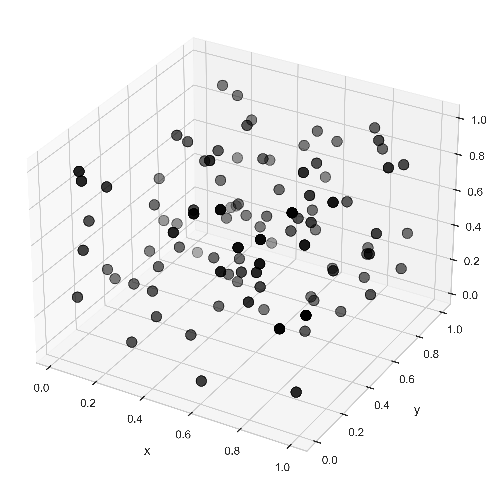

+++
title = "Computational Design"
outputs = ["Reveal"]
+++

# Computational Design

[Brendan Harmon](https://baharmon.github.io/)


Welcome. 
I am Brendan Harmon,
an assistant professor 
of landscape architecture
at Louisiana State University.
This lecture is an introduction
to computational design
and how it is tranforming the practice 
of the landscape architecture.


---



# Computational Design


...


---



# Algorithms
### “Precisely defined sets of mathematical or logical operations for the performance of a particular task.”

“algorithm, n”. In: Oxford English Dictionary Online. Oxford University Press, 2022. url: https:
//doi.org/10.1093/OED/1019775631.


Algorithms – 
“precisely defined sets of mathematical 
or logical operations for the performance
of a particular task” – 
when used creatively in art and design 
evoke a peculiar aesthetics of infinity. 


---



import numpy as np
import matplotlib.pyplot as plt
# create figure
ax = plt.subplot(projection='3d')
# instantiate random number generator
rng = np.random.default_rng()
# generate random x-, y-, and z-values
n = 100
x = rng.random(n)
y = rng.random(n)
z = rng.random(n)
# plot points
plot = ax.scatter(
    x, y, z, 
    c='black', 
    s=100
    )
    
    
    
    
    
    
    

----




...


---




Grasshopper...


---

# Generative Art


Algorithms that model the behavior of natural systems, such as fractals, cellular automata, branching and venation, differential growth, hyphae, slime molds, and flocking, can produce infinite, complex patterns that evolve over time. In generative art, artists use such algorithms as performances that hide, reveal, and transform meaning. As the algorithm runs, step by step, the performance unfolds. Although the code of the algorithm may remain hidden, the artist’s intention is transformed by the algorithm; the artwork’s meaning accumulates through performance. Even when the audience only sees a final resulting image or form – rather than an ongoing animation or performance – the algorithm leaves its mark, traces of its process, of its logic. Algorithms can express infinity through endless performance and the emergence of complexity from simple rules. While works of generative art and computational design are diverse, spanning a wide range of disciplines, media, and themes, there is a common current – the aesthetic of the algorithm. This algorithmic aesthetics of infinity is abstract, non-representational, and performative.


---

# [Infinite Regeneration](https://www.infinite.center/2021/01/27/infinite-regeneration/)
## Jared S. Tarbell, 2021

---




Jared Tarbell's Infinite Regeneration
particles drift endlessly through
a field of procedural noise,
evoking the emergence of complexity
from simple systems.


---

# [Pleasant Places](https://quayola.com/pleasant-places/)
## Quayola, 2015

---




In Quayola’s Pleasant Places,
film footage of a landscape is gradually transformed by algorithms to reveal the sublime in nature. As image analysis, image processing, and audio signal processing algorithms progressively distort the original footage and sound, the landscape becomes more and more abstract with windswept leaves, grasses, and flowers gradually transforming into swirls of color. In its eventual abstraction this video alludes to the impressionist tradition of landscape painting, but as a performance it explores the dynamic nature of sensation, memory, and the environment.


---

# [Remains: Vallée de Joux](https://quayola.com/remains-vallee-de-joux/)
## Quayola, 2018

---




Quayola’s Remains are a series of point cloud renderings of woodland scenes, captured with
laser scanning and rendered as points. An exploration of light as a medium, these point cloud renderings are both indexical representations of reality and algorithmic abstractions. The imperfections of the technology give rise to a painterly, pointillist aesthetic that evokes the material and immaterial.


---



# Computational Design
## in Architecture


In computational design this aesthetics of the algorithm is given form in landscape and the built environment. In computational design, designers, rather than drawing or modeling a singular form, write code or compose visual programs that generate form. The designer scripts a creative process, a generative system. By designing algorithms rather than discrete forms, designers can rapidly explore design ideas and generate variations on a theme.


---



# [Endless Wall](https://gramaziokohler.arch.ethz.ch/web/e/projekte/216.html)
## Gramazio Kohler Research, 2011


Pioneering work by Gramazio Kohler Research at ETH Zürich explored the creative, aesthetic, and material implications of on-site robotic construction. 


---




In the Endless Wall, an articulated robotic arm on a mobile base tirelessly performed the Sisyphean task of continually reassembling a brick wall. As a performance, the Endless Wall expressed an algorithmic aesthetics of infinity through its continual cycle of construction and deconstruction. 


---

# [Pahoehoe Beauty](https://maeid.com/works/pahoehoe-beauty)
## MAEID, 2018


The interdisciplinary practice MAEID explores the entanglement of technology and nature through creative experiments in robotic biofabrication such as Pahoehoe Beauty, Magic Queen, and Sylva. 


---




In MAEID's Pahoehoe Beauty,
a landscape is 3D printed with mud.
With its strange techno-organic aesthetic
- defined by the biologically-inspired 
algorithms for dendritic growth and the 
physics of mud - 
this work of speculative design
problematizes binary conceptions
of technology and nature
by entangling them in uncanny ways. 


---

# [Sylva](https://maeid.com/works/slyva)
## MAEID, 2021


In MAEID's Sylva, 
robotic gardeners tend 
an artificial ecosystem. 


---




The robots, using machine vision to interpret their environment, are programmed to seed, water, or trim the plants. While the plants rely on the robots for care, the robots – acting in response to their environment – only move in response to the plants. This performative installation asks how technology and nature can coexist in symbiosis, exploring themes of empathy, coexistence, non-human subjectivity, and distributed agency.


---

# Computational Design
## in Landscape Architecture

---

# Title
## Designer, Date


...


---




...


---

# Title
## Designer, Date


...


---




...


---

# Title
## Designer, Date


...


---




...


---

# Robotic Embankment
## Jud, Hurkxkens, & Hutter, 2020


Swiss Federal Institute of Technology in Zürich


---




...


---




...


---




...


---

# Credits

* [Snøhetta](https://snohetta.com/)
* [Nervous System](https://n-e-r-v-o-u-s.com/)
* [deCOi Architects](http://www.decoi-architects.org/)
* [University of Stuttgart, ICD](https://www.icd.uni-stuttgart.de/projects/)
& [ITKE](https://www.itke.uni-stuttgart.de/)
* [Carl Fredrik Svenstedt Architect](https://www.carlfredriksvenstedt.com/)
* [Olivier van Herpt](http://oliviervanherpt.com/)
* [USACE ERDC](https://www.erdc.usace.army.mil/)
* [ETH Zurich, Gramazio & Kohler](https://gramaziokohler.arch.ethz.ch/)
* [Joris Laarman](https://www.jorislaarman.com/)
* [ETHZ dfab](https://dfab.ch/)
* [ETHZ Landscape Architecture](https://girot.arch.ethz.ch/)
* [Benedikt Groß](http://benedikt-gross.de/)

