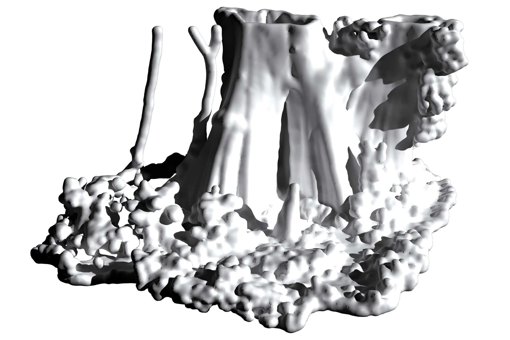
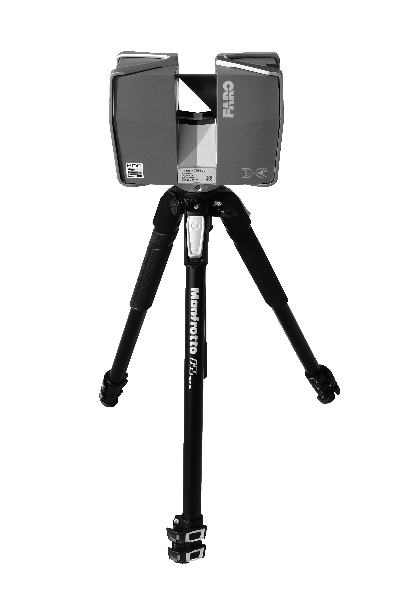

+++
title = "Computational Ecology for Landscape Architects"
outputs = ["Reveal"]
+++

# Computational Ecology
### for Landscape Architects

[Brendan Harmon](https://baharmon.github.io/)


Hello. 
I am Brendan Harmon,
an assistant professor of landscape architecture
at Louisiana State University.
Today I will be talking about
my recent research and teaching.
While I have expertise in the spatial sciences,
recently I have been focused on 
computational ecology and 
computational design 
- on computational methods 
for ecological research
and the creative use of computation 
in the design process.
This talk will explore several applications
of computational ecology and design -
the preservation of heritage landscapes,
planting and remote sensing with robots,
lidar analytics and biomass estimation, 
and point cloud modeling. 


---

# Robotics


I am exploring creative applications for robots.


---



# Ecological Robotics


I have been developing methods
for robotic planting 
in the lab and the field.
Here, for example, 
is the field robot that I will use 
for autonomous planting in the field.


---




In the lab I developed a process 
for 3D printing with seeds.
I use a robotic system to extrude seeds 
in a paste of clay, planting media, and water.
With robotic paste-based extrusion,
seeds can be precisely planted
in computationally generated patterns.
Initially I tested this process in the lab,
printing in small trays
with mixes of seeds
in different patterns.


---




This prototype uses Grasshopper 
to generate planting designs
and program the robot and extruder.
With this process, 
planting patterns could be generated from
procedural noise gradients,
cellular automata,
space filling curves,
AI image generation,
and other algorithms.


---




To scale up, I will deploy this
planting system on a field robot.
I plan to experiment with other 
methods for autonomous planting
such as seed hoppers.
Eventually I plan to conduct 
a controlled field experiment.
After autonomously seeding test plots,
I will use lidar to monitor growth.
With autonomous seeding at field scale,
landscapes can be 
planted iteratively and adaptively
and designed for ecological performance
with new computational aesthetics. 



---




With robotic planting,
ecological gradients - for example -
can be computationally designed and
and autonomously planted.
Here is a gradient of procedural noise.


---




And here are seedlings
planted in a prodecural noise gradient. 


---



# Echo



With new media artist Hye Yeon Nam
sound artist Ka Hei Cheng, 
I used autonomous planting to highlight
the entanglement of nature and technology.
We transformed a 3D printed planting design
into a new musical instrument. 


---




By embedding capacitive touch sensors
in the soil,
we transformed plants
into a living interface for
sonic performance. 
Touching the seedlings plays a sample
from a sound palette 
of environmental recordings.


---

# Computational Ecology


My recent research in computational ecology
explores the use of lidar
to estimate biomass and carbon. 


---



# Drone Data Analytics


Since 2020 I have been using drones
with lidar and multispectral sensors
to study the evolution of the meadow
established at LSU's Hilltop Arboretum.


---




With regular aerial surveys 
I can map fluxes of aboveground biomass and carbon
in the meadow. 
Here, for example, is 
a 3D scatterplot of
the net annual biomass of the meadow
in its first year. 
By accounting for carbon storage in meadows and prairies,
we can demonstrate their ecoystem services
and advocate for their creation or conservation.


---



# Atlas of Heritage Trees


For another project 
- the Atlas of Heritage Trees -
I am laser scanning ancient trees
of significant historical, 
cultural, and ecological importance.
Louisiana has many large, old, 
and culturally significant specimens
of southern live oak and bald cypress. 
These trees are charismatic megaflora – 
specimens that capture 
the imagination of the public 
and encourage broader support 
for biodiversity conservation.
To preserve a record of these 
irreplaceable cultural icons, 
we are compiling an Atlas of Heritage Trees.
As a digital humanities project,
this research aims to document and share
the legacy of these heritage trees.
As a work of computational ecology,
this research aims to estimate the 
biomass and carbon of large, old trees
which act as keystone ecological structures. 


---


As part of this project,
I have developed a method 
for building volumetric models
from laser scanned point clouds. 
This volumetric modeling process 
can be used to calculate 
the volume of large, old trees
with extensive cavities
for biomass and carbon estimation. 
It can also be used to 3D print models 
of these specimens
for outreach, education, and exhibition.


---




Here, for example, 
is a 3D print of the Big Cypress,
a 1500 year old Bald Cypress 
on Cat Island in Louisiana.
It is the largest recorded bald cypress
and the reigning national champion.


---

# Heritage Preservation


My research in heritage preservation 
uses remote sensing technologies 
such as lidar
to preserve a record
of disappearing heritage landscapes.


---


I use drones with lidar, 
terrestrial laser scanning,
and neural radiance fields
to record the spatial structure
and phenomenological character
of heritage landscapes.


---



# Rosedown


With funding from the National Park Service,
my colleague Nick Serrano and I
scanned Rosedown Plantation
in St. Francisville, Louisiana.
Rosedown is unique for its 
extant, largely intact plantation gardens;
these gardens are important
not only for being representative of 
plantation garden design in the American South,
but also as artifacts of enslaved labor.


---




With terrestrial laser scanning,
we captured temporal aspects of the landscape
such as the flowers in bloom on the rockery
- pictured here -
and the spanish moss swaying
on the live oak allee. 


---




The scan of the tunnel through the rockery,
captured details such as the pebble wash
and the moss and lichen on the bricks.
This level of immersive detail records
some of sensory experience
and phenomenological character
of the site in ways that other media cannot.


---




The scan of the service staircase
captures how the tall steps are worn underfoot,
recording an index of the labor of the enslaved.


---



# African American Burial Grounds


With an interdisciplinary team of colleagues,
I have begun a long term project
to preserve a record of the burial grounds
of enslaved African Americans 
and their descendants.
In the American South, 
These sites have long faced 
precarious conditions; 
originally built peripheral 
to antebellum plantations, 
today many occupy remnant parcels 
of isolated land. 
Climate change, 
industrial expansion, 
precarious land-tenure records, 
and dwindling populations 
of descendant communities 
threaten these cultural landscapes. 
The aim of this project 
is to develop a methodology for documenting 
the history, material culture, 
ecological character, and soundscapes 
of these neglected heritage sites. 
Here is a point cloud of Alford Cemetery
captured by a drone with a lidar module.
With drone lidar,
we can record these landscapes 
and their surroundings
at centimeter resolution. 


---




With terrestrial laser scanning,
we can record gravesites in immersive detail.
We are also experimenting with 
new scanning techniques such as 
neural radiance fields. 


---

# Point Clouds


I am also interested in point clouds
as a new design medium for landscape architecture,
that is both hyper-detailed, yet also abstract.


---



# Point Cloud Modeling


I have been experimenting with
point cloud modeling techniques.
Complex, detailed scenes can be composited
by segmenting, transforming, and merging point clouds. 
Features can be classified and segmented
either manually or automatically
with algorithms and machine learning techniques.
Segmented point clouds can be transformed manually 
or algorithmically with, for example, Grasshopper.
Here is a simple example of 
randomly scattered laser scanned plants.


---

# Future Research

* **Project:** field robotics

* **Paper** computational aesthetics

* **Book:** computational ecology

* **GIS plugins:** earthworks and mass flows of water and sediment

* **Grasshopper plugins:** lidar & geospatial analytics





---

Learn more at
[**baharmon.github.io**](https://baharmon.github.io/)

