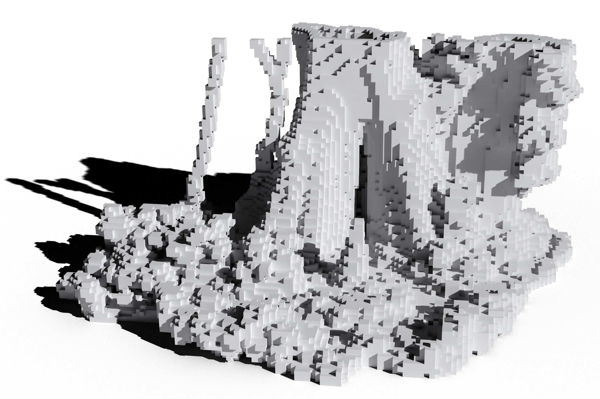
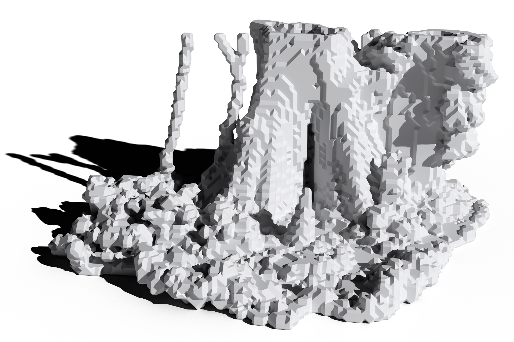

+++
title = "Computational Ecology for Landscape Architects"
outputs = ["Reveal"]
+++

# Computational Ecology

[Brendan Harmon](https://baharmon.github.io/)


Hello. 
I am Brendan Harmon,
an associate professor of landscape architecture
at Louisiana State University.
Today I will be talking about
my recent research and teaching.
While I have expertise in the spatial sciences,
recently I have been focused on 
computational ecology and 
computational design,
on computational methods 
for ecological research
and the creative use of computation 
in the design process.
My work centers on the entanglement of 
humans, technology, and the environment,
exploring speculative pathways to sustainability, 
grounded in a post-anthropocentric perspective
that problematizes our conception 
of nature and technology as other.


---



# Computational Ecology


My research program in computational ecology
uses lidar to estimate biomass and carbon
and ecoacoustics to study biodiversity in soundscapes.


---



## Drone Data Analytics


Since 2020 I have been using drones
with lidar and multispectral sensors
to study the evolution of the meadow
established at LSU's Hilltop Arboretum.
Along with this research program, 
I regularly teach drone piloting, photogrammetry, and lidar
to landscape architecture students
in my computational design course. 


---




I have been surveying the meadow monthly since it was first established.
With regular aerial surveys like this 
I can map fluxes of aboveground biomass and carbon in the meadow. 


---




Here you can see the bare ground after the initial bush hogging in January. 


---




And the evolution of the meadow over the months....


---



---



---



### Net Annual Biomass

&nbsp;

&nbsp;

&nbsp;

&nbsp;

&nbsp;

&nbsp;


From this time series of data 
we can calculate the fluctuations of biomass
and thus carbon in the meadow.
Here is a 3D scatterplot of the net annual biomass 
of the meadow in its first year. 


---



### Net Annual Carbon

&nbsp;

&nbsp;

&nbsp;

&nbsp;

&nbsp;

&nbsp;


By accounting for carbon storage in meadows and prairies,
we can demonstrate their ecosystem services
and advocate for their creation or conservation.


---



## Atlas of Heritage Trees


For another project 
- the Atlas of Heritage Trees -
I am laser scanning ancient trees
of significant historical, 
cultural, and ecological importance.
Louisiana has many large, old, 
and culturally significant specimens
of southern live oak and bald cypress. 
These trees are charismatic megaflora – 
specimens that capture 
the imagination of the public 
and encourage broader support 
for biodiversity conservation.


---




Here for example is the Duelling Oak in New Orleans,
a live oak infamous as a site for duels in the 19th century.
Duellists would face off between this tree and its partner
which was lost to a hurricane.


---




Large, old tree populations
are in decline around the world. 
Louisiana's ancient trees are at risk
due to coastal change,
lack of legal protection, 
and senescence.
For example this 600 year old bald cypress, 
the Monarch of the Swamp,
is slowly, but inevitably dying 
from salt water intrusion
as the coast of Louisiana retreats. 


---




To preserve a record of these 
irreplaceable cultural icons, 
I am compiling an Atlas of Heritage Trees.
As a digital humanities project,
this research aims to document and share
the legacy of these heritage trees.
As a work of computational ecology,
this research aims to estimate the 
biomass and carbon of large, old trees
which act as keystone ecological structures. 


---


As part of this project,
I have developed a method 
for building volumetric models
from laser scanned point clouds. 
My volumetric modeling process 
can be used to calculate 
the volume of large, old trees
with extensive cavities
for biomass and carbon estimation. 
It can also be used to 3D print models 
of these specimens
for outreach, education, and exhibition.



---




Here, for example, 
is a 3D print of the Big Cypress,
a 1500 year old Bald Cypress 
on Cat Island in Louisiana.
It is the largest recorded bald cypress
and the reigning national champion.


---



---



## Field Recordings


Recently I begun a research program in ecoacoustics,
recording the aural character of cultural landscapes
as a way to archive a trace of their biodiversity. 


---




We have recorded soundscapes for ancient trees 
and cultural landscapes across Louisiana. 
We use passive acoustic monitoring to capture long recordings
and ambisonics to capture immersive spatial audio.


---




With these recordings 
we can classify the acoustic activity 
of wildlife as well as anthropogenic noise,
to map species occurrence and disturbances.
Here is a spectrogram from a burial ground in Louisiana
where the songs of birds, cicadas, and crickets 
compete with the roar of traffic passing along River Road.


---




To engage the public, 
I collaborate with musicians to create 
immersive soundscape experiences.
For a recent exhibition of heritage trees,
we used tactile transducers to transform
the 3D printed specimens into speakers,
each playing its own soundscape.
Now we are working to reconstruct 
the soundscape of Mannahatta
before colonization in 1609.


---

<!--  -->

---


# Landscape Ecology


In the future I am interested in teaching landscape ecology.


---

## Landscape Ecology


**Pattern & Process**
* Ecosystems
* Structure
* Flows
* Disturbances
* Succession
----
**Conservation**
* Biogeography
* Biodiversity
* Bioacoustics
* Connectivity
* Rewilding
----
**Design**
* Complexity
* Restoration
* Phytoremediation
* Aesthetics
* Philosophy



I would like to develop a landscape ecology course 
that addresses not only theory, 
but also conservation, design, and philosophy. 


---

# Giant Panda National Park Studio

## Advanced Topics Studio









In my upper level studios, 
students have an opportunity
to apply creative computational thinking
to ecological problems.


---




In a studio on computational ecology, for example,
students designed a masterplan
for giant panda conservation
in Sichuan, China.


---




After fieldwork in the mountains, 
they used ecological models to simulate a network 
of ecologically functional corridors for giant pandas
that accounted for sensory ecology and stochastic variation.


---




Then they used Grasshopper to rapidly design 
ecologically diverse reforestation schemes
for these habitat corridors.


---

# Heritage Preservation


...


---


## Plantations


...


---




...


---




...


---



Drone lidar can be use for landscape archeology.
Since lidar can penetrate forest canopy, 
it can reveal hidden landforms, traces of past landscapes.
Le Petit Versailles 
was the 19th century pleasure garden of Valcour Aimee.
Long abandoned, the ruins of the garden 
are lost beneath dense overgrowth
and a canopy of mature southern live oaks.
In the future I plan to use these techniques 
to reveal lost histories and landscapes of the enslaved
throughout the southern United States.


---


## African American Burial Grounds


...


---




...


---




...


---




...


---




...


---




...


---




...


---




...


---




...


---

# Computational Design


...


---



## Ecological Robotics


I have been developing methods for
robotic planting in the lab and the field.


---




In the lab I developed a process for 3D printing with seeds.
I use a robotic system to extrude seeds in a paste
of clay, planting media, and water.


---




With robotic paste-based extrusion,
seeds can be precisely planted
in computationally generated patterns.
With robotic planting,
we can computationally design
and autonomously plant
ecological gradients.


---




To scale up, I will deploy this
planting system on a field robot.
After autonomously seeding a test plot
I will use lidar to monitor growth.


---

<!--


---


-->

---



## Point Cloud Modeling


...


---




...


---




...


---




...


---




...


---




...


---




...


---




...


---




...


---




...


---




...


---




...


---


# Computational Design


I also regularly teach a course on computational design
that introduces the basics of visual programming with Grasshopper. 


---

# Computational Design


**Fundamentals**
* Grasshopper
* Algorithms
* Stochasticity
* Noise
* Attractors
----
**Modeling**
* Tessellations
* Physics
* Simulation
* Point clouds
* Voxels
----
**Fabrication**
* Machining
* Printing
* Materials
* Robotics
* Construction



This course teaches creative computational thinking for design problems.
It introduces a procedural approach to design and making. 
Topics include randomness and noise, physics and simulations,
ceramic 3D printing, and robotic construction.


---

<!-- 

---


# Construction Robotics

---

## Construction Robotics


**Robotics**
* Introduction
* Operations
* Programming
* Sensing
* Applications
----
**Materials Research**
* Research
* Conceptualization
* Experimentation
* Fabrication
* Analysis
----
**Construction**
* Ideation
* Design
* Prototype
* Construction
* Documentation



I also teach creative applications
of robotics for autonomous construction. 
For example, in my classes, 
students learn how to
parametrically model brick walls
and then robotically lay the bricks.
 -->

---

# [The Siltcatcher](https://doi.org/10.31390/gradschool_theses.5135)

## [A Sediment-Capture System for Wetland Creation and Coastal Protection in Western Lake Pontchartrain](https://doi.org/10.31390/gradschool_theses.5135)

### Thesis, Andrew Wright, 2020








I also regularly teach research methods
and advise capstone and theses.
Here is an example of a thesis I advised
that uses simulation for speculative design. 
This thesis - the Siltcatcher - 
envisioned a system of offshore structures
for accumulating sediment from the Bonnet Carré Spillway
to catalyze the development of new wetlands.


---




The student used a physical hydrodynamic model
to test and evaluate design ideas.


---




He used simulations with tracer dye
to study the flow and accumulation of fine sediment...


---




and develop a design
that would catalyze land building
in Lake Pontchartrain.


---



---

<!--

# Spatial Science

---



## Earthworks

---



---



---



-->

---


# GIS for Designers


I have regularly taught an introduction to
geographic information systems for designers.


---

# GIS for Designers


**Fundamentals**
* Intro to GIS
* Geodesy
* Cartography
* Map algebra
* Programming
----
**Landscape**
* Lidar
* Terrain
* Hydrology
* Visibility
* Solar
----
**Urban**
* Urban data
* Demographics
* Walkability
* Map overlays
* 3D printing



Topics covered include cartography, map algebra, 
terrain modeling, hydrology, urban analytics, 
visual programming, and digital fabrication. 
For this course I have developed extensive tutorials,
a collection of Youtube videos, and datasets. 


---




I also publish open education materials online
including tutorials, videos, and datasets. 


---

# Future Work

* **Book:** GRASS Geocomputation Engine
* **Research:** Welikia Soundscape Engine
* **Software:** Earthworks in Grasshopper
* **Software:** Massive point clouds in Grasshopper

---

# Ideas

* **Research:** Lidar for mass timber
* **Research:** 3D printing mass timber
* **Research:** Neural rendering for biomass estimation

---

Learn more at
[**baharmon.github.io**](https://baharmon.github.io/)
