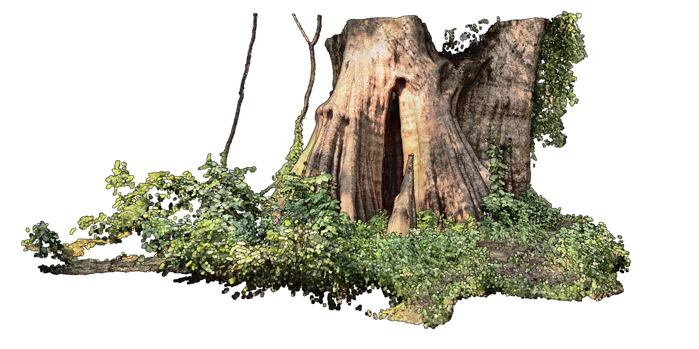

+++
title = "Computational Ecology for Landscape Architects"
outputs = ["Reveal"]
+++

# Computational Ecology

[Brendan Harmon](https://baharmon.github.io/)


Hello. 
I am Brendan Harmon,
an associate professor of landscape architecture
at Louisiana State University.
Today I will be talking about
my recent research and teaching.
While I have expertise in the spatial sciences,
recently I have been focused on 
computational ecology and 
computational design 
- on computational methods 
for ecological research
and the creative use of computation 
in the design process.


---



# Computational Ecology


This talk will explore several applications
of computational ecology and design including
planting and remote sensing with robots,
lidar analytics and biomass estimation, 
the preservation of heritage landscapes,
and point cloud modeling. 


---



## Drone Data Analytics


My recent research in computational ecology
explores the use of lidar
to estimate biomass and carbon. 
Since 2020 I have been using drones
with lidar and multispectral sensors
to study the evolution of the meadow
established at LSU's Hilltop Arboretum.
Along with this research program, 
I regularly teach drone piloting, photogrammetry, and lidar
to landscape architecture students
in my computational design course. 


---




Here is the fixed wing drone with a multispectral sensor
that I use to capture monthly imagery of the meadow
with red, green, blue, near infrared, and rededge channels.
With regular aerial surveys 
I can map fluxes of aboveground biomass and carbon
in the meadow. 
Here, for example, is 
a 3D scatterplot of
the net annual biomass of the meadow
in its first year. 
By accounting for carbon storage in meadows and prairies,
we can demonstrate their ecosystem services
and advocate for their creation or conservation.


---



---



---



---



---



### Net Annual Biomass

&nbsp;

&nbsp;

&nbsp;

&nbsp;

&nbsp;

&nbsp;

---



### Net Annual Carbon

&nbsp;

&nbsp;

&nbsp;

&nbsp;

&nbsp;

&nbsp;

---



## Atlas of Heritage Trees


For another project 
- the Atlas of Heritage Trees -
I am laser scanning ancient trees
of significant historical, 
cultural, and ecological importance.
Louisiana has many large, old, 
and culturally significant specimens
of southern live oak and bald cypress. 
These trees are charismatic megaflora – 
specimens that capture 
the imagination of the public 
and encourage broader support 
for biodiversity conservation.


---



---





Large, old tree populations, however, 
are in decline around the world. 
Louisiana's ancient trees are at risk
due to coastal change,
lack of legal protection, 
and senescence.
To preserve a record of these 
irreplaceable cultural icons, 
I am compiling an Atlas of Heritage Trees.
As a digital humanities project,
this research aims to document and share
the legacy of these heritage trees.
As a work of computational ecology,
this research aims to estimate the 
biomass and carbon of large, old trees
which act as keystone ecological structures. 


---



---


As part of this project,
I have developed a method 
for building volumetric models
from laser scanned point clouds. 
My volumetric modeling process 
can be used to calculate 
the volume of large, old trees
with extensive cavities
for biomass and carbon estimation. 
It can also be used to 3D print models 
of these specimens
for outreach, education, and exhibition.



---




Here, for example, 
is a 3D print of the Big Cypress,
a 1500 year old Bald Cypress 
on Cat Island in Louisiana.
It is the largest recorded bald cypress
and the reigning national champion.


---



---



## Field Recordings

---



---



---



---



---

# Heritage Preservation

---


## Plantations

---



---



---



Drone lidar can be use for landscape archeology.
Since lidar can penetrate forest canopy, 
it can reveal hidden landforms, traces of past landscapes.
Le Petit Versailles 
was the 19th century pleasure garden of Valcour Aimee.
Long abandoned, the ruins of the garden 
are lost beneath dense overgrowth
and a canopy of mature southern live oaks.
In the future I plan to use these techniques 
to reveal lost histories and landscapes of the enslaved
throughout the southern United States.


---


## African American Burial Grounds

---



---



---



---



---



---



---



---



---

# Computational Design

---



## Ecological Robotics


I have been developing methods for
robotic planting in the lab and the field.


---




In the lab I developed a process for 3D printing with seeds.
I use a robotic system to extrude seeds in a paste
of clay, planting media, and water.


---




With robotic paste-based extrusion,
seeds can be precisely planted
in computationally generated patterns.
With robotic planting,
we can computationally design
and autonomously plant
ecological gradients.


---




To scale up, I will deploy this
planting system on a field robot.
After autonomously seeding a test plot
I will use lidar to monitor growth.


---



---



---



## Point Cloud Modeling

---



---



---



---



---



---



---



---



---



---



---



---

# Spatial Science

---



## Earthworks

---



---



---



---

# Future Work

* **Book:** GRASS Geocomputation Engine
* **Research:** Welikia Soundscape Engine
* **Software:** Earthworks in Grasshopper
* **Software:** Massive point clouds in Grasshopper

---

# Ideas

* **Research:** Lidar for mass timber
* **Research:** 3D printing mass timber
* **Research:** Neural rendering for biomass estimation

---

Learn more at
[**baharmon.github.io**](https://baharmon.github.io/)

<!-- Ecoacoustics -->
<!-- Welikia Soundscape Engine -->
