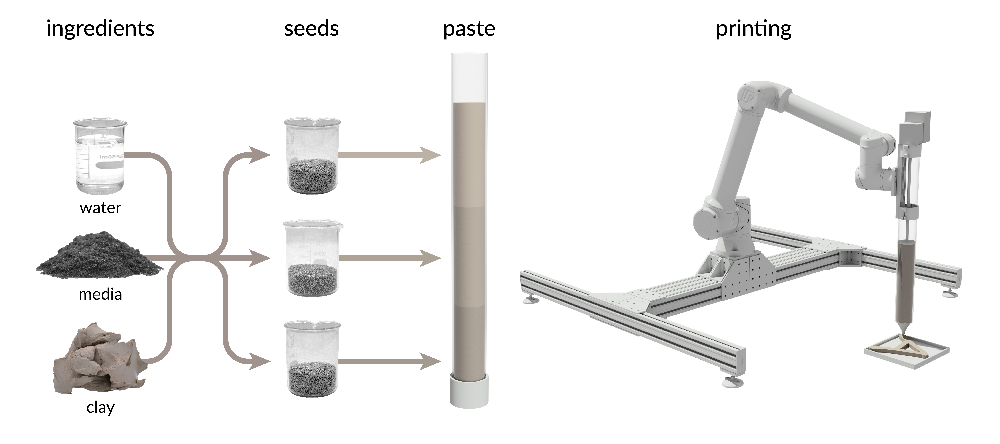
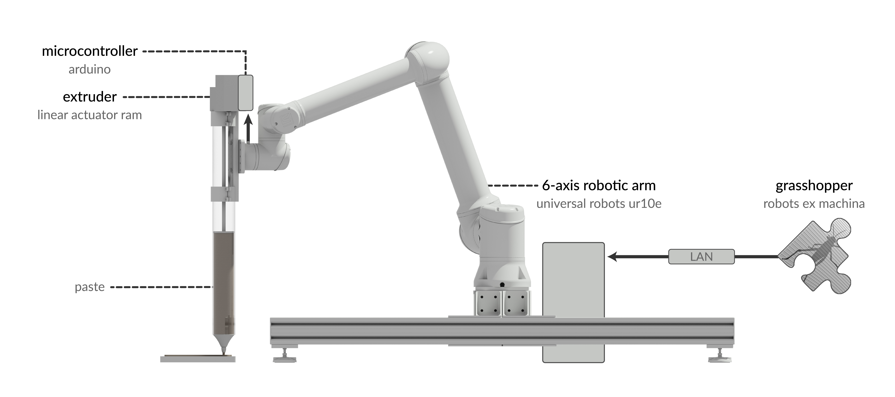
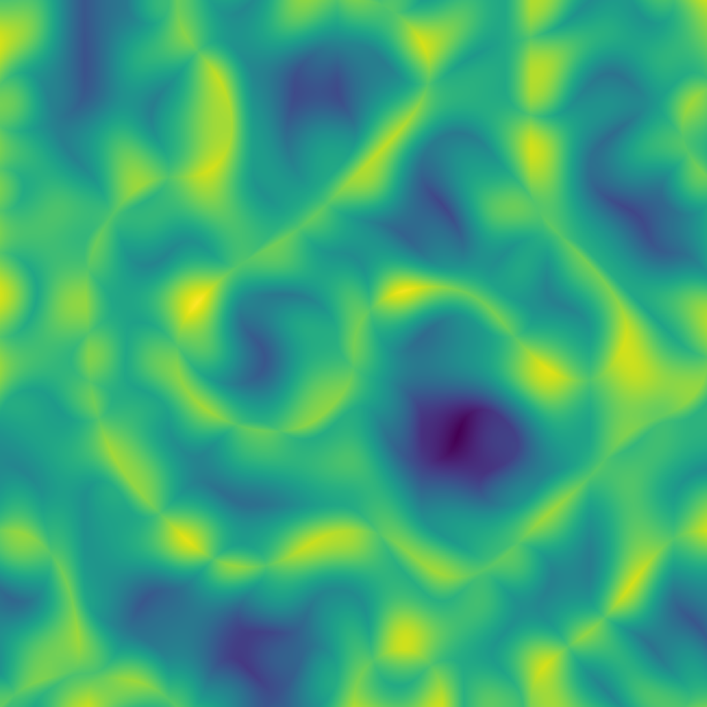

+++
title = "Ecological Robotics"
outputs = ["Reveal"]
+++

# Ecological Robotics

[Brendan Harmon](https://baharmon.github.io/) &
[Hye Yeon Nam](https://hynam.org/)


Hello. 
I am Brendan Harmon.
And I am Hye Yeon Nam.
We are presenting a novel method 
for autonomous planting.


---


# Ecological Robotics


We have developed a process for 3D printing with seeds.
By extruding a seeds in mud, 
we can print complex, computational planting patterns. 
While we tested this process in the lab
with an extruder mounted on an industrial robotic arm,
we plan to deploy it in the field
using unmanned ground vehicles.
With field robots
-- like the rover pictured here --
landscapes could be 
designed computationally
and planted autonomously. 
Autonomous planting promises 
new ecological and aesthetic opportunities.


---

# Robots in Architecture
* Autonomous brick laying
* Weaving tensile structures
* Assembling timber frames
* Constructing complex formwork
* 3D printing
* Etc...


Architects have been experimenting with
methods for autonomous construction.
They have developed robotic processes for
brick laying,
weaving tensile structures,
assembling timber frames,
constructing formwork,
and 3D printing materials such as
concrete, metal, and mud.


---

# Robots in Landscape Architecture
* Aerial Sensing
* Autonomous Planting
* Autonomous Mowing
* Autonomous Earthmoving


Landscape architects
have also been experimenting with robots.
They have developed methods for 
autonomous earth-moving, planting, and mowing. 
Through these experiments,
architects and landscape architects
have been exploring the novel
creative, material, tectonic, 
performative, and aesthetic potential 
of robots.


---

# Pasted-Based Robotic Planting


Our process for autonomous planting
is unique in its precision.
We use a robotic system
to extrude seeds in a paste
of clay, planting media, and water.
By extruding a paste we can 
print computationally generated patterns
with precision.


---

# Implementation


We use a linear actuator ram
to extrude the paste.
The extruder is controlled 
by an Arduino microcontroller
and mounted on 
an industrial robotic arm.
We use the Machina library
for Grasshopper
to program the robot and the extruder.


---

# Capabilities
* Computational patterns
* Microtopography
* High precision
* High germination rate


Our process for autonomous planting
can print computational patterns precisely.
Because it prints a paste,
it builds microtopography.
Because the seeds 
are already in soil as a paste,
they have a high germination rate. 


---

# Computational Planting Design


We can print 
algorithmically generated planting patterns.
Here are patterns 
generated from procedural noise --
from cellular,
cellular gradient, 
Perlin fractional Brownian motion,
and Perlin billow noise. 
We could also generate patterns
from cellular automata,
space filling curves,
and other algorithms.


---


# Procedural Noise Prints


Initially we tested our process in the lab,
printing in small trays.
We experimented with mixes of seeds
in different patterns.
Here, for example, is 
a print based on Perlin noise.


---

# Living Typography
Robotic planting as living typeface


To test the precision of our process,
we printed letterforms. 


---




Here is an example.
As the robot prints,
the paste extrudes fairly smoothly.
We formulate the paste carefully,
balancing plasticity 
and growing conditions.
As the seeds germinate, 
seedlings sprout out of paste, 
their roots growing into the ground below. 


---

# Echo
Robotic planting as musical interface


With the musician Ka Hei Cheng
we transformed a 3D printed planting design
into a new musical instrument. 


---




We embedded capacitive touch sensors
in the soil to transform the plants
into a living interface for
sonic performance. 
Touch the plants plays a sample
from a sound palette 
of environmental recordings.


---


# Field Experiment


We also conducted a field experiment.


---


# Field Experiment


Our grasses grew vigorously;
albeit too vigorously for the scale 
of planting pattern we tested.


---

# Future Work
* Deploy on unmanned ground vehicles
* Integrate machine vision & sensors
* Develop new methods for autonomous planting
* Design algorithmic planting patterns
* Conducted controlled field experiments


To scale up, we will deploy our 
planting system on a field robot.
We will integrate sensors onto the robot
so that we can account for 
topography while printing
and monitor plant growth afterwards.
We will experiment with other 
methods for autonomous planting
such as seed hoppers.
Eventually we plan to conduct 
a controlled field experiment.


---


# Field Robotics
### Clearpath Warthog UGV


This is our new unmanned ground vehicle.
It has real-time kinematic GNSS,
a robotic arm, and a lidar module.
We will integrate an extruder
onto the arm and start planting.


---

# Conclusion
* Ecological performance
* Iterative, adaptive planting
* Algorithmic aesthetics


With autonomous planting,
we can design for ecological performance,
plant iteratively and adaptively,
and develop new aesthetics. 

