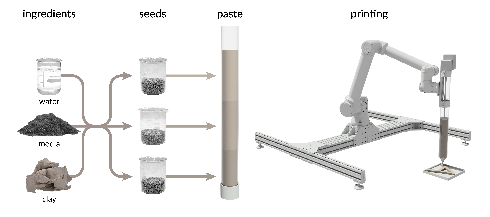
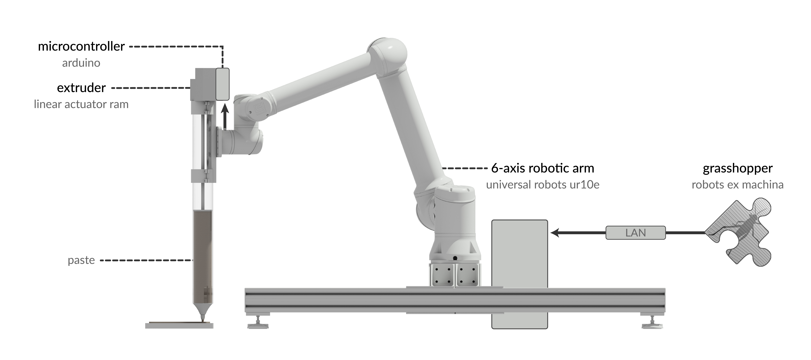
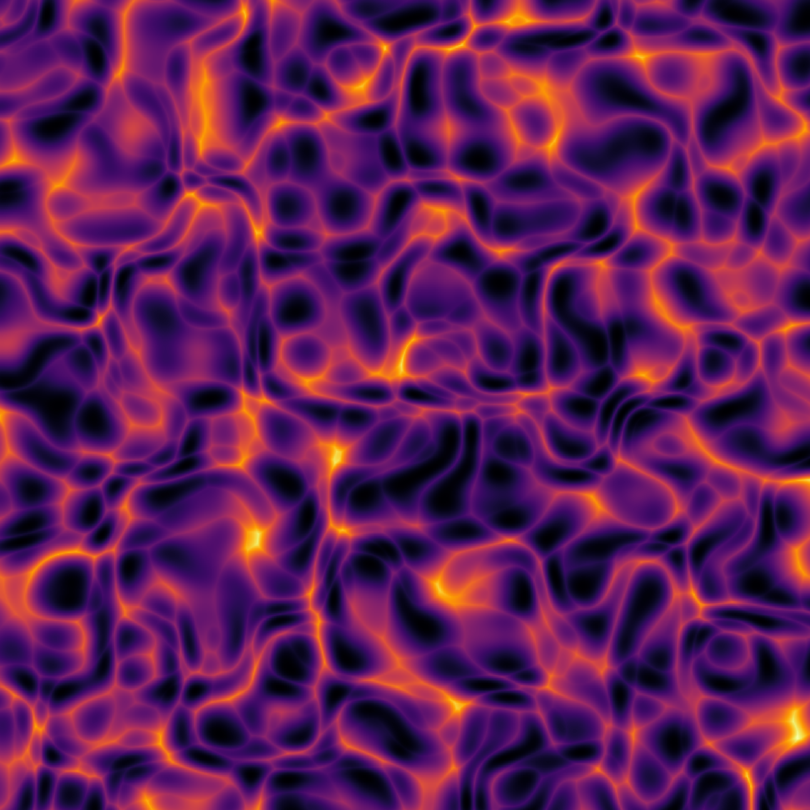

+++
title = "Ecological Robotics"
outputs = ["Reveal"]
+++

# Ecological Robotics

[Brendan Harmon](https://baharmon.github.io/) &
[Hye Yeon Nam](https://hynam.org/)

---


# Ecological Robotics

---

# Robots in Architecture
<!-- processes -->
* Autonomous brick laying
* Weaving tensile structures
* Assembling timber frames
* Constructing complex formwork
* 3D printing
* Etc...

---

# Robots in Landscape Architecture
* Aerial Sensing
* Autonomous Planting
* Autonomous Mowing
* Autonomous Earthmoving


Vacuum Seeding
Seed Drilling
Aerial Seeding


---

# Pasted-Based Robotic Planting

---

# Paste-Based Robotic Planting

---

# Paste-Based Robotic Planting
* Computational patterns
* Microtopography
* High precision
* High germination rate

---

# Computational Planting Design

---


# Procedural Noise Prints

---

# Living Typography
Robotic planting as living typeface

---



---

# Echo
Robotic planting as musical interface

---



---


# Field Experiment

---


# Field Experiment

---

# Future Work
* Deploy on unmanned ground vehicles
* Integrate machine vision & sensors
* Develop new methods for autonomous planting
* Design algorithmic planting patterns
* Conducted controlled field experiments


Design autonomous planting methods such as printing, seed hoppers, etc


---


# Field Robotics
### Clearpath Warthog UGV

---

# Conclusion
* Ecological performance
* Iterative, adaptive planting
* Algorithmic aesthetics

---
