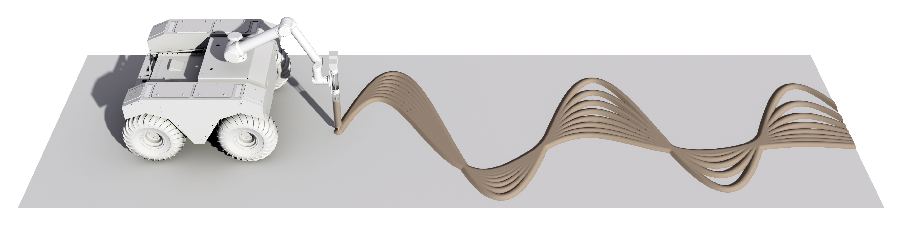

+++
title = "Ecological Robotics"
outputs = ["Reveal"]
+++

# Ecological Robotics

[Brendan Harmon](https://baharmon.github.io/) &
[Hye Yeon Nam](https://hynam.org/)

---

# Ecological Robotics
<!-- concept diagram with printing, field robotics, and sensing -->

---

<!--# Autonomous Construction-->

# Robots in Architecture
<!-- processes -->
* Autonomous brick laying
* Weaving tensile structures
* Assembling timber frames
* Constructing complex formwork
* 3D printing

---


# Robotic Brick Laying
### [ETH Zurich, Gramazio & Kohler, Endless Wall, 2011](http://dfab.arch.ethz.ch/web/e/forschung/216.html)

---

# Robots in Landscape Architecture
* Aerial Sensing
* Autonomous Planting
* Autonomous Mowing
* Autonomous Earthmoving




---


## [Benedikt Groß, Avena+ Test Bed, 2013](http://benedikt-gross.de/log/2013/06/avena-test-bed_agricultural-printing-and-altered-landscapes/)

---


## [ETHZ dfab, Robotic Embankment](https://dfab.ch/streams/construction-robotics)

---

<!--
# Robotic Planting
* Vacuum Seeding
* Seed Drilling
* Aerial Seeding
-->

# Pasted-Based Robotic Planting

---

# Paste-Based Robotic Planting
Technical Diagram

---


# Algorithmic Planting Patterns
<!-- noise plots -->

---


# Procedural Noise Prints
<!-- image: noise print -->

---

# Living Typography
Robotic planting as living typeface

---



---

# Echo
Robotic planting as musical interface

---



---

# Future Work
* Deploy on unmanned ground vehicles
* Integrate machine vision & sensors
* Develop new methods for autonomous planting
* Design algorithmic planting patterns
* Conducted controlled field experiments


Design autonomous planting methods such as printing, seed hoppers, etc


---

# Field Robotics

---


# Field Robotics

---

# Implications

---

# Credits
* [ETH Zurich, Gramazio & Kohler](https://gramaziokohler.arch.ethz.ch/)
* [ETHZ dfab](https://dfab.ch/)
* [Benedikt Groß](http://benedikt-gross.de/)
* [MAEID]()

---

# 

---

# 

---

# 

---

---


# Slide with background

text...

---



---