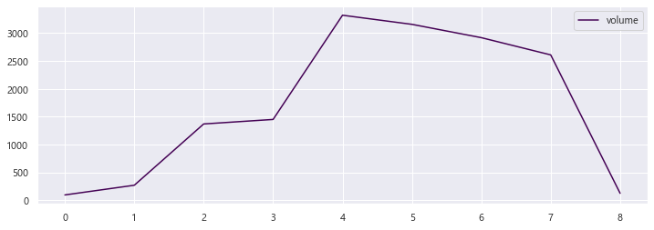

+++
title = "Geospatial Modeling"
outputs = ["Reveal"]
+++


# Geospatial Modeling

Brendan Harmon

---

# Paradigms of Science
* Empirical
* Theoretical
* Computational
* Data

---

# Geospatial Modeling & Analysis
* Geomorphometry
* Ecology
* Etc...

---

# Geospatial Simulation
* Urbanization
* Hydrology
* Ecological corridors
* Etc...

---

# Geomorphometry

Quantitative analysis of the earth's surface

---

## Lidar

**Location:** New Orleans, Louisiana

**Dataset:** [U.S. Army Corps of Engineers 2012 Lidar Survey of New Orleans](https://coast.noaa.gov/htdata/lidar2_z/geoid12b/data/6350/)

**Software:** GRASS GIS, Rhino, RhinoTerrain, & Thea Render

---



---



---

## Laser Scanning

**Location:** [LSU Art & Design Quad](https://skfb.ly/6VW7w), Baton Rouge, LA

**Author:** [Brendan Harmon](https://baharmon.github.io/) et al.

**System:** Faro Focus Laser Scanner

**Software:** CloudCompare

---



---

## Drone Photogrammetry

**Location:** Lake Wheeler, Raleigh, NC

**Author:** Justyna Jeziorska, [NCSU GeoForAll Lab](https://geospatial.ncsu.edu/geoforall/)

**System:** UX5 Drone

**Software:** Metashape

---



---


## Digital Elevation Model

---


## Slope

---


## [**Geomorphons**](https://doi.org/10.1016/j.geomorph.2012.11.005)

---


## Geomorphons

---


## Geomorphons: Ridges

---


## Topographic Convergence

---


## Topographic Convergence: Ridges

---

# Ecological Analytics

---

## Multispectral Drone Photogrammetry

**Location:** Hilltop Arboretum, Baton Rouge, LA

**Author:** Brendan Harmon

**System:** FireFLY Pro with Micasense RedEdge

**Software:** Metashape, GRASS GIS, Python

---


## Coastal Tallgrass Prairie Ecosystem

---


## Aerial Survey

---



---



---


## 2020-03-19

---


## 2020-04-25

---


## 2020-06-01

---


## 2020-06-30

---


## 2020-08-03

---


## 2020-08-29

---


## 2020-09-27

---


## 2020-10-25

---


## 2021-01-24

---


## Biomass 2020

---

## Volume 2020-2021

---

## Carbon 2020
* Aboveground carbon stock: 2,900 $kgC$
* Belowground carbon stock: 29,820 $kgC$
* Carbon stock: 32,721 $kgC$
* Carbon pool: 7,047 $gC/m^{2}$

---

## Research Questions
* What is the carbon pool of the meadow?
* How will the carbon pool change as the meadow matures?
* Can designed meadows be effective stores of carbon?
* How can drone data analytics inform management?

---

# Urban Growth Simulation

---

## [FUTURES](https://cnr.ncsu.edu/geospatial/research/futures/)

The **[FUTure Urban-Regional Environment Simulation (FUTURES)](https://cnr.ncsu.edu/geospatial/research/futures/)**
is regional scale model for simulating the conversion of rural to urban land
based on a potential submodel, per capita demand submodel,
and a patch growing algorithm.

---

## FUTURES
| Submodel | Predictors |
|---|---|
| Development pressure | Protected areas |
|  | Slope |
|  | Roads |
|  | Water |
|  | Forest |
|  | City center |
| Demand | Population statistics |
| Patch growing algorithm | Historic urbanization |

---



---



---



---



---

## FUTURES
* Where is growth happening?
* Where is growth predicted?
* How should we rethink development?

---

# Hydrological Simulation

---

## [SIMWE](https://grass.osgeo.org/grass78/manuals/r.sim.water.html)
The Simulation of Water Erosion **(SIMWE)**
simulates shallow flows of water and sediment over landscapes.

---


## Shallow Water Flow Discharge
## $$(m^3/s)$$

---


## Normalized Difference Vegetation Index (NDVI)

---


## Shallow Water Flow Discharge with Landcover from NDVI
## $$(m^3/s)$$

---

# Ecological Corridor Simulation

---

## [LSCorridors](https://github.com/LEEClab/LS_CORRIDORS)

**Spatial Ecology and Conservation Lab (LEEC), Sao Paulo State University**

LandScape Corridors (LSCorridors)
simulates multiple functional ecological corridors
based on species movement and landscape connectivity.
*https://doi.org/10.1111/2041-210X.12750*

---

# Giant Panda Habitat Corridors

**Location:** Sichuan, China

**Team:** Andrew Wright, Tanvi Shah, & Brendan Harmon

**Software:** GRASS GIS & LSCorridors

**Research Question:** What land needs to be protected to ensure the long-term survival of Giant Pandas?

---



---



---

# Software

| Program | Applications | Open Source |
|---|---|---|
| [QGIS](https://qgis.org/) | GIS | ✔ |
| [GRASS GIS](https://grass.osgeo.org/)| GIS & remote sensing | ✔ |
| [SAGA GIS](http://www.saga-gis.org/) | GIS | ✔ |
| [ArcGIS](https://www.esri.com/) | GIS | |
| [TerrSet](https://clarklabs.org/) | GIS & remote sensing | |
| [ERDAS Imagine](https://www.hexagongeospatial.com/products/power-portfolio/erdas-imagine) | remote sensing | |
| [Metashape](https://www.agisoft.com/) | photogrammetry | |
| [Pix4D](https://www.pix4d.com/) | photogrammetry | |
| [Google Earth](https://www.google.com/earth/) | virtual globe | |
| [Leaflet](https://leafletjs.com/) | web mapping | ✔ |
| [Mapbox](mapbox.com) | web mapping | |

---

# Generative Design

Integrate geospatial modeling into the design process with Grasshopper

* Terrain modeling & grading with [Docofossor](https://www.food4rhino.com/app/docofossor)
* Terrain modeling with [Bison](https://www.food4rhino.com/app/bison)
* Terrain modeling with [RhinoTerrain](https://www.rhinoterrain.com/)
* Vector mapping with [Mosquito](http://www.synthetic.space/synthetic/2443/)

---


## Docofossor

---


## RhinoTerrain

---

# Learn More

* [**Geospatial Modeling and Analysis**](https://ncsu-geoforall-lab.github.io/geospatial-modeling-course/), Helena Mitasova, NCSU
* [**GIS for Designers**](https://baharmon.github.io/gis-for-designers), Brendan Harmon, LSU
* [**QGIS for Hydrological Applications**](https://www.youtube.com/c/HansvanderKwast/), Hans van der Kwast, IHE Delft
