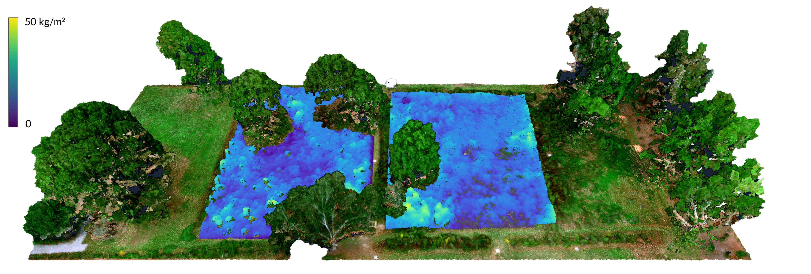

+++
title = "Point Cloud Aesthetics"
outputs = ["Reveal"]
+++

# Point Cloud Aesthetics
[Brendan Harmon](https://baharmon.github.io/) &
[Nicholas Serrano](https://design.lsu.edu/faculty/serrano-nicholas)

---


# Point Cloud Aesthetics
### [Rosedown Plantation](https://xyz.cct.lsu.edu/data/rosedown/landscape.html)

---

## Point Cloud Semiotics

---

# Points Clouds
**Point Clouds**
are algorithmically mediated, indexical encodings
of space and color at a moment in time

---

## Indexicality
**Indices** are physically and causally connected to what they represent


Footprint: a physical imprint of a foot.
Smoke: caused by a fire.
Photograph: a record of light.


---


## Index of an Index
### [**Rosedown Plantation**, Slave Staircase](https://xyz.cct.lsu.edu/data/rosedown/interior.html)



---

## Perceptual Index
**Perceptual Indices** are traces of objects
 
[**Hilltop Arboretum**, January 24, 2020](https://xyz.cct.lsu.edu/data/hilltop/meadow.html)



---

## Conceptual Index
**Conceptual Indices** are traces of ideas
 
[**Hilltop Arboretum**, net annual biomass](https://xyz.cct.lsu.edu/data/hilltop/meadow.html)

Algorithmically mediated...


---

## Symbolism
**Symbols** are given meaning by convention


Point clouds are encoded as data
and rendered as signs given meaning by convention


---


## Perceptual Symbolism
### [**Rosedown Plantation**, Wallpaper](https://xyz.cct.lsu.edu/data/rosedown/interior.html)



---

## Symbolic Structure
Encoded as a symbolic **data structure**

| X         | Y         | Z         |R |G |B |
|-----------|-----------|-----------|--|--|--|
-1.38539982|-2.95930004|-8.80980003|53|41|45
-1.08609962|-2.85930014|-8.68869996|74|45|40
-1.30480003|-2.65850019|-8.70860004|16|8|7
-0.80039978|-2.58699989|-8.75689995|161|133|126
-0.82590008|-2.53049994|-8.19280005|151|137|136
-0.35680008|-2.37580013|-8.59280002|18|17|18
-0.35239983|-2.40630007|-8.21350002|123|62|48
-0.69639969|-2.26340008|-8.67620003|26|24|22
-0.70779991|-2.26650000|-8.07910001|49|57|69
-0.20359993|-2.04750013|-8.65110004|42|41|49
0.29399967|-1.95119953|-8.60870004|53|65|91
0.37310028|-1.43799973|-8.64540005|122|89|76

Algorithmic: Transcribed from photons into bits


---

## Iconicity
**Icons** look like what they represent




---


## Hyperreal Icons
### **Simulacra** displace reality

An unfaithful representation of a working landscape...


---


## Contingency
### The **contingent** is subject to change and chance

---

## Enfolding-Unfolding Aesthetics
 
[Laura Marks](https://www.sfu.ca/~lmarks/), [**Enfoldment & Infinity**](https://mitpress.mit.edu/books/enfoldment-and-infinity)

---

## Algorithmic Aesthetics

---

## [http://xyz.cct.lsu.edu/](http://xyz.cct.lsu.edu/)
