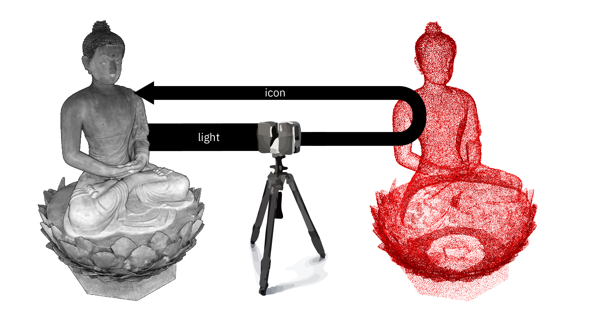
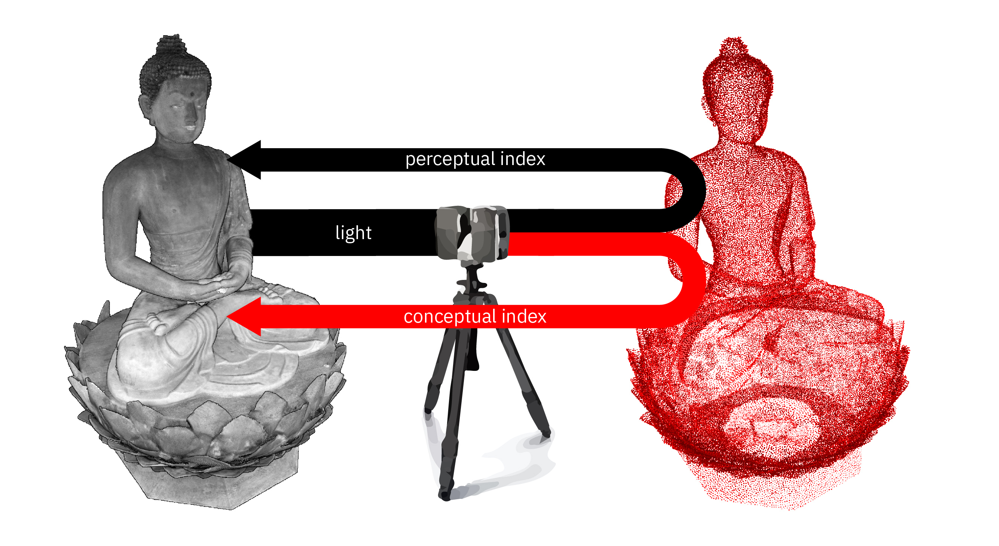
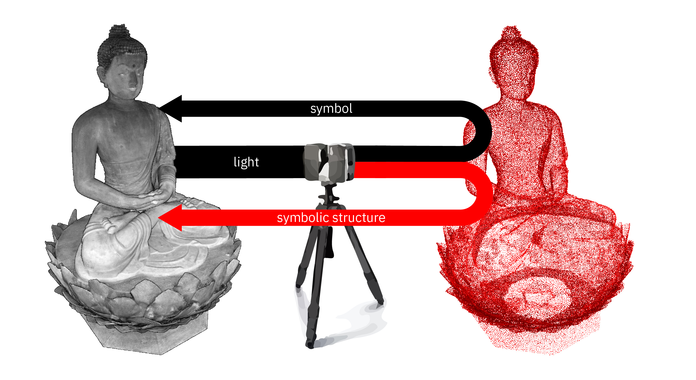
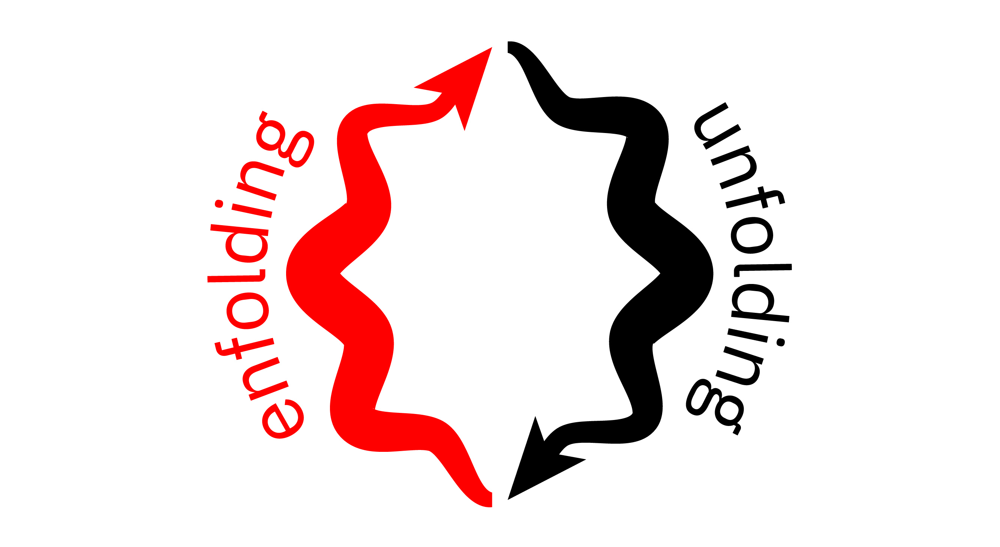
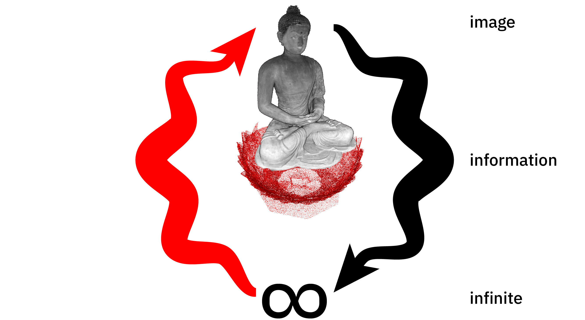

+++
title = "Point Cloud Aesthetics"
outputs = ["Reveal"]
+++

# Point Cloud Aesthetics
[Brendan Harmon](https://baharmon.github.io/) &
[Nicholas Serrano](https://design.lsu.edu/faculty/serrano-nicholas)

---


# Point Cloud Aesthetics
### [Rosedown Plantation](https://xyz.cct.lsu.edu/data/rosedown/landscape.html)

Hello, my name is Brendan Harmon [and I am Nicholas Serrano]. We are on the faculty at Louisiana State University and today will be sharing some of our ongoing research into the aesthetics of point clouds. This presentation is part of our ongoing research thinking through the aesthetics of point clouds. Many of the examples in this presentation are from a recent project to scan and create a digital model of the Rosedown Plantation in Saint Francisville, Louisiana. We want to thank the National Parks Service and the Louisiana Department of Culture, Recreation, and Tourism for their support of this project.


---



---

## Points Clouds
**Point Clouds**
are algorithmically mediated, indexical encodings
of space and color at a moment in time

Point clouds are algorithmically mediated, indexical encodings of space and color at an instance in time. While previous research has demonstrated the technical viability of point clouds for empirically oriented practice, the theoretical implications of point clouds for artistic aspects of land-scape architecture still need to be explored.


---

## Cloudism

*Designers adopting cloudism will step into
an overwhelmingly convincing simulacra of physical reality, space and time;
this will enhance their understanding of site,
and yield a stronger awareness of ambient aspects and cues.*

[Christophe Girot](https://girot.arch.ethz.ch/), [**Cloudism**](https://doi.org/10.1515/9783035622164-013)

Christophe Girot proposed that point clouds are a new medium for designing landscape, positing that “designers adopting cloudism will step into an overwhelmingly convincing simulacrum of physical reality, space and time; this will enhance their understanding of site, and yield a stronger awareness of ambient aspects and cues.” We argue that point clouds are unique in their indexicality, iconicity, symbolism, and contingency, and they can be used to represent the dynamic character of landscape in new ways.


---

## Point Cloud Semiotics


Today we will be focusing on the semiotics of point clouds as a medium of landscape architecture. As a medium, point clouds are both data structure and subject—the physical environment. The algorithms that generate point clouds simultaneously enable and constrain the creative process.


---

## Iconicity
**Icons** look like what they represent


An icon is mimetic, a likeness. Point clouds are iconic because they look like what they represent. Unlike photographs, point clouds are not flat; as multi-dimensional data that can be interactively rendered, they have an immersive sense of depth. They have an indexical link to the scene captured that imbues them with authenticity and fidelity to reality.


---

## Indexicality
**Indices** are physically and causally connected to what they represent


Indices are a trace of the real. In Peirce’s semiotics, an index is a sign that is physically or causally connected to what it represents. As a trace, independent of other meaning, they have an inherent authenticity. Point clouds are algorithmically mediated, indexical encodings of space and color with unique indexical authority.


---


## Perceptual Index
### **Perceptual Indices** are traces of objects

Point clouds, like photographs, are perceptual indicies when they represent traces of the real as immediately legible, iconic renderings of a scene. Close examination of a slave staircase reveals the imprint of footsteps, an index of their toil. Despite the erasure of the enslaved people’s quarters and community, the point cloud still reveals marks of their presence.


---



---

## Conceptual Index
**Conceptual Indices** are traces of ideas
 
[**Hilltop Arboretum**, net annual biomass](https://xyz.cct.lsu.edu/data/hilltop/meadow.html)

Point clouds can also be conceptual indices. We can numerically analyze landscapes through point clouds using remote sensing techniques, temporal aggregation, and map algebra to study spatiotemporal phenomena such as photosynthetic activity, biomass accumulation, and carbon cycling. This data can then be represented through three-dimensional scatterplots overlaid with the transects, thereby rendering quantitative analysis spatially anchored in the point cloud. Despite their intensive algorithmic processing, they still retain indexical links to the landscape as data that record traces of its processes. They represent a trace of an idea such as the process of growth and senescence or the flux of carbon, rather than the look and physical structure of the landscape.


---



---

## Symbolism
**Symbols** are given meaning by convention


Symbols are signs whose meaning is read through convention such as words, allegories, or emojis. While the scene captured in a point cloud may have symbolic significance, point clouds are inherently symbolic as algorithmically encoded data.


---

## Symbolic Structure
Encoded as a symbolic **data structure**

| X         | Y         | Z         |R |G |B |
|-----------|-----------|-----------|--|--|--|
-1.38539982|-2.95930004|-8.80980003|53|41|45
-1.08609962|-2.85930014|-8.68869996|74|45|40
-1.30480003|-2.65850019|-8.70860004|16|8|7
-0.80039978|-2.58699989|-8.75689995|161|133|126
-0.82590008|-2.53049994|-8.19280005|151|137|136
-0.35680008|-2.37580013|-8.59280002|18|17|18
-0.35239983|-2.40630007|-8.21350002|123|62|48
-0.69639969|-2.26340008|-8.67620003|26|24|22
-0.70779991|-2.26650000|-8.07910001|49|57|69
-0.20359993|-2.04750013|-8.65110004|42|41|49
0.29399967|-1.95119953|-8.60870004|53|65|91
0.37310028|-1.43799973|-8.64540005|122|89|76

The transcription of photons into bits, rather than irrevocably converting an index into a symbol, algorithmically mediates meaning. The point cloud remains a pure perceptual index of the referent, while as a conceptual index it becomes symbolically mediated by algorithms. The conceptual index—the trace of ideas—becomes a mark not only of the scene, but also of the author and algorithms.


---


## Hyperreal Icons
### **Simulacra** displace reality

Point clouds have a unique indexical authority in being interactive, three-dimensional records of space. Their indexicality, their truth claim, seems so authoritative as to be hyperreal, displacing reality. Girot questioned what it means to “step into an overwhelmingly convincing simulacrum of physical reality, space and time?” Will point clouds as hyperreal simulacra really enhance our understanding of site? Or, will the hyperreal usher an aesthetic crisis of creativity, an “end of the imaginary,” as Baudrillard suggested.


---



---

## Contingency
### The **contingent** is subject to change and chance

However, point clouds are imperfect icons with noise, systematic errors, occlusions, and voids. The contingency of point clouds makes them a fundamentally abstract medium, countering their hyperrealism. The resulting image is pointillist with rich aesthetic tension between its hyperreal detail and painterly abstraction.


---



---

## Enfolding-Unfolding Aesthetics
 
[Laura Marks](https://www.sfu.ca/~lmarks/), [**Enfoldment & Infinity**](https://mitpress.mit.edu/books/enfoldment-and-infinity)

Drawing on the Deleuzian concept of the fold, new media scholar Laura Marks has proposed an algorithmic aesthetics of enfolding and unfolding.


---

## Algorithmic Aesthetics


In this algorithmic aesthetics, infinite possibility coalesces – unfolds –into information and then image. Interpreting an image reveals the multiplicity of information enfolded in the image; interpreting that information in turn reveals infinite possibility. In this semiotic process “[i]mage is an interface to information, and information is an interface to the infinite.” (Marks 2010, 7). This is an aesthetics of abstraction, contingency, time, performance, immanence, and infinity.


---

## Conclusion

* Indexical, iconic, and symbolic contingency
* Perceptual and conceptual indexicality
* Polyvalent meaning


The indexical, iconic, and symbolic contingency of point clouds is generative, forming a creative space between author, algorithm, and environment. Aesthetic potential lies in the tension between perceptual and conceptual indexicality, while semiotic complexity affords a multiplicity of meaning held in aesthetic tension for the audience to decode. By challenging point clouds’ purely representational potential, point clouds can become a creative tool for design and the foundation for aesthetic expression in this emerging medium.


---

## [http://xyz.cct.lsu.edu/](http://xyz.cct.lsu.edu/)
