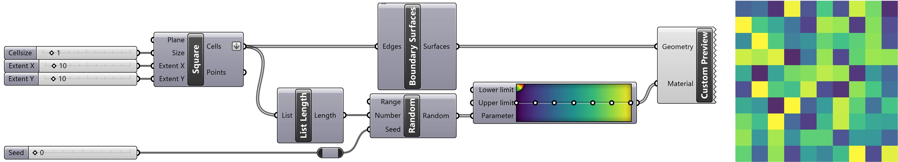

+++
title = "Randomness"
outputs = ["Reveal"]
+++

# Randomness
[Brendan Harmon](https://baharmon.github.io/)

---

# Randomness

**Randomness**



---

**Stochasticity**




---


# What is random here?

---

# Windswept pines

**Stochasticity**





---


# What is random here?

---

# Point Cloud Landscape

**Noise**





Environment: wind, illumination, etc 
Sensor: motion, focus, etc
Processing: misaligned camera poses, hallucinations, etc


---



# What is random here?
## [Andrew Kudless, Color Slice, 2013-2014](https://www.matsys.design/color-slice)
<!---->
<!--## [Andrew Kudless, P_Wall, 2009](https://www.matsys.design/p_wall-2009)-->

---

# [Andrew Kudless, Color Slice, 2013-2014](https://www.matsys.design/color-slice)

**Creative Contingency**




---

<!--

# Randomness
## in Ecological Surveys
---
# Transect Sampling
---
# Grid Sampling
---
# Random Sampling
---
-->


# Randomness
## in Ecological Patterns

---


# Spatial homogeneity

---

# Spatial homogeneity
**Grids**




---


# Ecological Succession

---

# Ecological Succession
**As grids breakdown**




---

# Randomness with Grasshopper

---


# Randomness
## Standard Normal Distribution

---


# Standard Normal Distribution
<!-- Move before gradient -->

&nbsp;

&nbsp;

&nbsp;

&nbsp;

&nbsp;

&nbsp;

---


# Ecological Gradients
**Caused by**








---


# Gaussian Distribution

---


# Gaussian Distribution

&nbsp;

&nbsp;

&nbsp;

&nbsp;

&nbsp;

&nbsp;

---


# Laplace distribution

&nbsp;

&nbsp;

&nbsp;

&nbsp;

&nbsp;

&nbsp;

---


# Poisson distribution

&nbsp;

&nbsp;

&nbsp;

&nbsp;

&nbsp;

&nbsp;

---

# Noise

**Noise**



---

# White Noise

**Static**


---



---

# [Semiconductor, Brilliant Noise, 2006](https://semiconductorfilms.com/art/brilliant-noise/)

**Solar wind**



---


# Cellular Distance Noise

---


# Cellular Gradient Noise

---


# Perlin Noise

---


# Gradient Noise

---


# Multifractal Noise

---


# Billow Noise

---


# Randomness 
## in Planting Design

**Randomness**






---


# Mixed Planting System
## [Bettina Jaugstetter, ABB Ladenburg Industrial Park](https://jaugstetter-landschaftsarchitektur.de/projekte/industrieparks/)

---

# [Bettina Jaugstetter, ABB Ladenburg Industrial Park](https://jaugstetter-landschaftsarchitektur.de/projekte/industrieparks/)

**Modular planting**





---


# Random Seeding
## [Tom Stuart Smith, The Barn Pairie](https://www.tomstuartsmith.co.uk/projects/meadows-praries)

---

# [Tom Stuart Smith, The Barn Pairie](https://www.tomstuartsmith.co.uk/projects/meadows-praries)

**Random seeding**







Other designers include James Hitchmough, Nigel Dunnett, & Larry Weaner


---


# Procedural Planting

---


# [Procedural Planting](https://baharmon.github.io/)

---


# [Procedural Planting](https://baharmon.github.io/)

---

# [Procedural Planting](https://baharmon.github.io/)

**Point cloud modeling**



---


# Procedural Mowing
## [Michael Geffel, Viridic Disturbance](https://www.lndlab.com/)

---

## [Michael Geffel, Viridic Disturbance](https://www.lndlab.com/)

**Procedural mowing**



---


# Randomness in Paving
## [Land Collective, Cummins Distribution Headquarters](https://land-collective.com/projects/cummins-distribution-headquarters/)

---

# [Land Collective, Cummins Distribution Headquarters](https://land-collective.com/projects/cummins-distribution-headquarters/)

**Procedural paving**



---


# Noise in Bricklaying
## [Gramazio & Kohler, Augmented Bricklaying](https://gramaziokohler.arch.ethz.ch/web/e/projekte/371.html)

---


# [Gramazio & Kohler, Augmented Bricklaying](https://gramaziokohler.arch.ethz.ch/web/e/projekte/371.html)

---

# [Gramazio & Kohler, Augmented Bricklaying](https://gramaziokohler.arch.ethz.ch/web/e/projekte/371.html)

**Bricklaying**



---


# Robotic bricklaying

---

Learn more at
[**baharmon.github.io**](https://baharmon.github.io/)

<!-- mogrify -format webp -quality 80 *.jpg -->